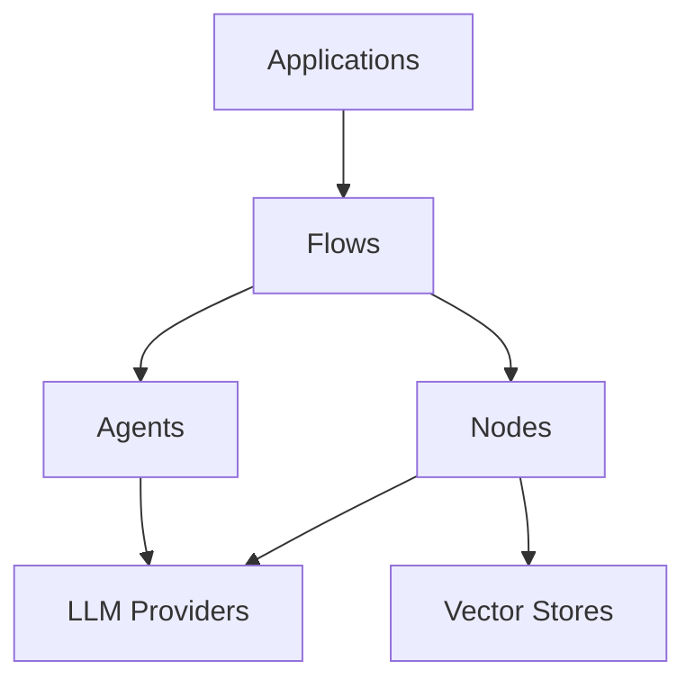

# Core Concepts

Manas is built around several key architectural concepts that work together to provide a flexible and powerful framework for building LLM-powered applications.

## Framework Architecture

At its core, Manas uses a modular, flow-based architecture where different components work together through well-defined interfaces:



### Component Interactions

1. **Applications** define the high-level logic using Flows
2. **Flows** orchestrate Nodes and Agents
3. **Nodes** perform specific tasks using Providers
4. **Providers** interface with LLMs and Vector Stores

## Key Components

### 1. Agents

Agents are autonomous entities that can:
- Process information
- Make decisions
- Take actions
- Learn from results

```python
from core import Agent, LLM

# Create an agent with specific capabilities
agent = Agent(
    llm=LLM.from_provider("openai"),
    system_prompt="You are a research assistant.",
    tools=[search_tool, calculator_tool]
)

# Agent processes input and uses tools as needed
result = agent.generate("Research quantum computing and calculate its market size")
```

#### Agent Lifecycle

1. **Think**: Process input and plan actions
2. **Act**: Execute planned actions using tools
3. **Observe**: Process results and update state

### 2. Flows

Flows coordinate multiple nodes to accomplish complex tasks:

```python
from core import Flow
from core.nodes import QANode, DocumentNode

# Create specialized nodes
researcher = QANode(name="researcher", llm=model)
analyst = QANode(name="analyst", llm=model)
writer = QANode(name="writer", llm=model)

# Create and configure flow
flow = Flow()
flow.add_node(researcher)
flow.add_node(analyst)
flow.add_node(writer)

# Define node relationships
flow.add_edge(researcher, analyst)
flow.add_edge(analyst, writer)
```

#### Flow Features

- **Directed Graph**: Nodes connected with directed edges
- **Parallel Execution**: Independent nodes run concurrently
- **State Management**: Maintains flow execution state
- **Error Handling**: Graceful failure handling

### 3. Nodes

Nodes are specialized components that perform specific tasks:

- **QANode**: Question-answering processing
- **DocumentNode**: Document processing and analysis
- **ToolNode**: External tool integration
- **APINode**: API interaction

```python
from core.nodes import ToolNode

# Create a tool node
calculator = ToolNode(
    name="calculator",
    tool=calculator_function,
    description="Performs mathematical calculations"
)
```

### 4. RAG (Retrieval-Augmented Generation)

RAG enhances LLM responses with relevant context:

```python
from core import RAG
from core.vectorstores import FaissVectorStore

# Initialize RAG system
rag = RAG(
    llm=model,
    vector_store=FaissVectorStore(dimension=1536)
)

# Add documents to knowledge base
rag.add_documents([
    "Document about quantum computing",
    "Research paper on algorithms"
])

# Query with context enhancement
response = rag.query("Explain quantum algorithms")
```

#### RAG Components

1. **Document Processing**: Chunking and embedding
2. **Vector Storage**: Efficient similarity search
3. **Context Integration**: Enhancing prompts with context
4. **Response Generation**: Context-aware responses

## Design Principles

### 1. Modularity

Every component is designed to be:
- Self-contained
- Independently testable
- Easily replaceable
- Well-documented

### 2. Extensibility

The framework supports easy extension through:
- Provider interfaces
- Custom node types
- Tool registration
- Middleware system

### 3. Asynchronous First

Built for high performance with:
- Async/await patterns
- Concurrent execution
- Efficient resource use
- Proper cleanup

### 4. Type Safety

Strong typing throughout:
- Type hints
- Runtime validation
- Interface contracts
- Safe type coercion

## Provider Architecture

### LLM Providers

Support for multiple LLM providers:

```python
# OpenAI provider
openai_model = LLM.from_provider("openai", model_name="gpt-4")

# Anthropic provider
claude_model = LLM.from_provider("anthropic", model_name="claude-3")

# HuggingFace provider
hf_model = LLM.from_provider("huggingface", model_name="mistral-7b")

# Local provider
ollama_model = LLM.from_provider("ollama", model_name="llama2")
```

### Vector Stores

Multiple vector store options:

```python
# FAISS store
faiss_store = FaissVectorStore(dimension=1536)

# Chroma store
chroma_store = ChromaStore(collection_name="docs")

# Pinecone store
pinecone_store = PineconeStore(index_name="embeddings")
```

## Middleware System

Middleware enhances provider capabilities:

```python
from core.providers.middleware import (
    MemoryMiddleware,
    LoggingMiddleware,
    RateLimitingMiddleware
)

# Configure middleware
model = LLM.from_provider(
    "openai",
    model_name="gpt-4",
    middleware=[
        MemoryMiddleware(memory_store),
        LoggingMiddleware(),
        RateLimitingMiddleware(max_rpm=60)
    ]
)
```

### Common Middleware

1. **Memory**: Conversation history
2. **Logging**: Request/response logging
3. **Rate Limiting**: Request throttling 
4. **Caching**: Response caching
5. **Monitoring**: Usage tracking

## Flow Patterns

### 1. Sequential Processing

```
A → B → C → D
```

For tasks that need sequential processing:
- Document analysis
- Multi-step reasoning
- Progressive refinement

### 2. Parallel Processing

```
    B →
A →     D
    C →
```

For independent subtasks:
- Concurrent research
- Parallel analysis
- Independent validations

### 3. Feedback Loops

```
A → B → C
↑       ↓
D ← E ← F
```

For iterative improvement:
- Refinement cycles
- Quality improvement
- Learning loops

## Best Practices

### 1. Flow Design

- Keep flows focused and simple
- Use appropriate node types
- Handle errors gracefully
- Monitor performance

### 2. Agent Configuration

- Clear system prompts
- Appropriate tools
- Proper state management
- Resource cleanup

### 3. RAG Implementation

- Effective chunking
- Appropriate embeddings
- Query optimization
- Cache management

### 4. Error Handling

- Graceful degradation
- Proper logging
- User feedback
- Recovery strategies

## Practical Examples

### Research Assistant

```python
from core import Flow
from core.nodes import QANode, DocumentNode

def create_research_flow(topic):
    # Create specialized nodes
    researcher = QANode(
        name="researcher",
        system_prompt="Research the given topic thoroughly."
    )
    
    analyst = QANode(
        name="analyst",
        system_prompt="Analyze and synthesize research findings."
    )
    
    writer = QANode(
        name="writer",
        system_prompt="Create a well-structured report."
    )
    
    # Create flow
    flow = Flow()
    flow.add_nodes([researcher, analyst, writer])
    flow.add_edge(researcher, analyst)
    flow.add_edge(analyst, writer)
    
    return flow

# Use the flow
flow = create_research_flow("quantum computing")
report = flow.process("Explain recent advancements")
```

### Document Analysis

```python
from core import RAG
from core.nodes import DocumentNode

def analyze_documents(documents):
    # Create RAG system
    rag = RAG(llm=model, vector_store=vector_store)
    
    # Add documents
    rag.add_documents(documents)
    
    # Create analysis node
    analyzer = DocumentNode(
        name="analyzer",
        llm=model,
        rag_system=rag
    )
    
    # Process documents
    results = analyzer.process("Extract key insights")
    return results
```

## Advanced Topics

### 1. Custom Nodes

```python
from core.nodes import BaseNode

class CustomNode(BaseNode):
    """Custom node implementation."""
    
    async def process(self, input_data):
        # Custom processing logic
        result = await self.custom_logic(input_data)
        return result
```

### 2. Provider Implementation

```python
from core.providers import BaseProvider

class CustomProvider(BaseProvider):
    """Custom LLM provider."""
    
    async def generate(self, prompt):
        # Custom generation logic
        response = await self.custom_generate(prompt)
        return response
```

### 3. Flow Optimization

```python
# Optimize flow execution
flow = Flow(
    parallel_execution=True,
    max_concurrency=4,
    timeout=30
)

# Add performance monitoring
flow.add_middleware(PerformanceMonitor())
```

## Next Steps

Now that you understand the core concepts:

1. Follow the [Getting Started Guide]({{ site.baseurl }}/getting-started/)
2. Explore [Examples]({{ site.baseurl }}/examples/)
3. Review [API Reference]({{ site.baseurl }}/api/)
4. Check [FAQ]({{ site.baseurl }}/faq/) for common questions