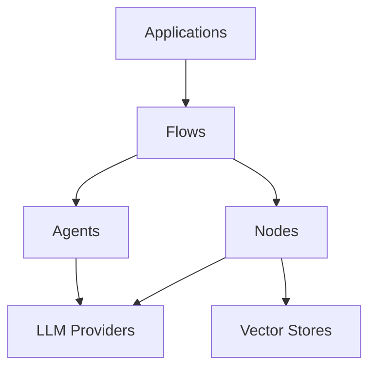

# Project Structure

This guide explains the organization of the Manas codebase to help you understand where to find different components and how they work together.

## Overview

The project follows a modular architecture with clear separation of concerns:

```
manas/
├── core/              # Core framework implementation
│   ├── nodes/        # Node implementations
│   ├── providers/    # LLM provider integrations
│   └── vectorstores/ # Vector store implementations
├── docs/             # Documentation
├── examples/         # Example applications
└── tests/            # Test suite
```

## Core Components

### core/ Directory

The `core/` directory contains the main framework implementation:

#### Base Files
- `agent.py`: Agent system implementation
- `base.py`: Base classes and interfaces
- `chat.py`: Chat-related functionality
- `flow.py`: Flow orchestration system
- `llm.py`: LLM interface and management
- `models.py`: Data models and types
- `rag.py`: RAG implementation
- `tokenizers.py`: Token counting utilities

#### core/nodes/
Node implementations for different purposes:
- `__init__.py`: Node exports
- `api_node.py`: API integration nodes
- `document_node.py`: Document processing nodes
- `factory.py`: Node creation factory
- `protocol.py`: Node protocols and interfaces
- `qa_node.py`: Question-answering nodes
- `tool_node.py`: Tool integration nodes

#### core/providers/
LLM provider integrations:
- `__init__.py`: Provider exports
- `anthropic.py`: Anthropic Claude integration
- `base.py`: Base provider classes
- `factory.py`: Provider creation factory
- `huggingface.py`: HuggingFace integration
- `middleware.py`: Provider middleware
- `mock.py`: Mock provider for testing
- `ollama.py`: Ollama integration
- `openai.py`: OpenAI integration
- `protocol.py`: Provider protocols

#### core/vectorstores/
Vector store implementations:
- `__init__.py`: Vector store exports
- `base.py`: Base vector store classes
- `chroma.py`: ChromaDB integration
- `factory.py`: Vector store factory
- `faiss.py`: FAISS integration
- `pinecone.py`: Pinecone integration
- `protocol.py`: Vector store protocols

## Documentation Structure

### docs/ Directory

Documentation is organized by topic:

```
docs/
├── _api/           # API reference documentation
├── _data/         # Site data files
├── _examples/     # Example code documentation
├── _includes/     # Reusable components
├── _layouts/      # Page layouts
├── _sass/         # Custom styles
├── api/           # API guides
├── assets/        # Static assets
└── examples/      # Example guides
```

#### Key Documentation Files
- `index.md`: Home page
- `getting-started.md`: Installation and basic usage
- `concepts.md`: Core concepts and architecture
- `benchmarking.md`: Performance benchmarks
- `contributing.md`: Contribution guidelines
- `faq.md`: Common questions and answers
- `llm-integration.md`: LLM integration guide
- `structure.md`: This project structure guide

## Example Applications

### examples/ Directory

Contains practical examples and tutorials:

- `ollama_tool_test.py`: Ollama integration example
- `simple_ollama.py`: Basic Ollama usage
- `test_tool_agent.py`: Tool agent testing
- `tool_using_agent.py`: Tool integration example
- `two_node_flow.py`: Multi-node flow example
- `utils.py`: Utility functions

## Test Suite

### tests/ Directory

Comprehensive test coverage:

- `benchmark_flow.py`: Flow performance tests
- `flow_proof_runner.py`: Flow validation tests
- `helpers.py`: Test helpers and utilities
- `simple_flow_test.py`: Basic flow tests
- `stress_test_flow.py`: Load testing
- `test_llm.py`: LLM provider tests
- `test_nodes.py`: Node implementation tests
- `utils.py`: Test utilities
- `validate_flow_scaling.py`: Scaling validation

## Dependency Management

### Root Directory Files

- `pyproject.toml`: Project metadata and dependencies
- `poetry.lock`: Locked dependency versions
- `__init__.py`: Package initialization
- `LICENSE`: MIT license
- `README.md`: Project overview
- `spec.md`: Technical specifications

## Module Dependencies

The framework follows a layered architecture:



### Layer Responsibilities

1. **Applications Layer**
   - User applications
   - Example implementations
   - Integration points

2. **Flow Layer**
   - Flow orchestration
   - Node management
   - Message routing

3. **Node Layer**
   - Node implementations
   - Task processing
   - Tool integration

4. **Provider Layer**
   - LLM integration
   - Vector store management
   - External service connections

## Best Practices

When working with the codebase:

1. **Adding New Features**
   - Place core logic in appropriate `core/` subdirectory
   - Add tests in corresponding test files
   - Include example usage in `examples/`
   - Update documentation

2. **Making Changes**
   - Maintain module boundaries
   - Follow existing patterns
   - Update dependencies carefully
   - Keep documentation in sync

3. **Testing**
   - Add unit tests for new code
   - Update integration tests
   - Use mock providers for testing
   - Validate changes with benchmarks

4. **Documentation**
   - Update API reference for changes
   - Add examples for new features
   - Keep structure documentation current
   - Include docstrings

## Environment Setup

For development:

```bash
# Clone repository
git clone https://github.com/arkokoley/manas.git
cd manas

# Install dependencies
poetry install

# Install development extras
poetry install --extras "test docs"

# Run tests
poetry run pytest

# Build documentation
poetry run mkdocs build
```

## Next Steps

- Read the [Contributing Guide]({{ site.baseurl }}/contributing/) for development workflow
- Explore the [API Reference]({{ site.baseurl }}/api/) for detailed documentation
- Check [Examples]({{ site.baseurl }}/examples/) for practical usage
- Review [Core Concepts]({{ site.baseurl }}/concepts/) for architecture details